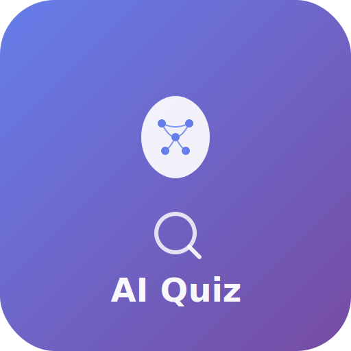

```markdown
# 🚀 AI Powered English Quiz | PWA

<div align="center">
  
  <p>Yapay zeka destekli modern İngilizce öğrenme platformu</p>
  
  [](LICENSE)
  [](https://developer.mozilla.org/en-US/docs/Web/Progressive_web_apps)
  [](https://github.com/okanveritas/englishai/commits/main)
</div>

## ✨ Özellikler
- 📱 **Tam PWA Desteği** (Ana ekrana eklenebilir)
- 🧠 **ChatGPT Entegrasyonu** ile akıllı quizler
- 📊 **Gerçek Zamanlı İlerleme Takibi**
- 🌙 **Karanlık/Açık Tema** Desteği
- 🔄 **Offline Çalışma** Özelliği

## 🏗️ Teknolojiler
- HTML5, CSS3, JavaScript (ES6+)
- Service Workers
- Web App Manifest
- Responsive Tasarım

## 🚀 Hızlı Başlangıç
```bash
git clone https://github.com/okanveritas/englishai.git
cd englishai
```

## 🌍 Canlı Demo
[👉 https://okanveritas.github.io/englishai/](https://okanveritas.github.io/englishai/)

## 📜 Lisans
MIT Lisansı - Detaylar için [LICENSE](LICENSE) dosyasına bakınız.

---

<div align="center">
  <sub>❤️ Okan Yaldız tarafından geliştirildi | 2023</sub>
</div>
```
